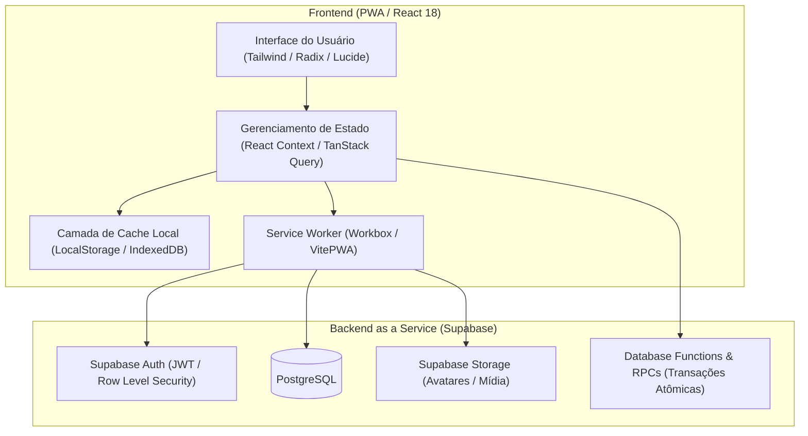
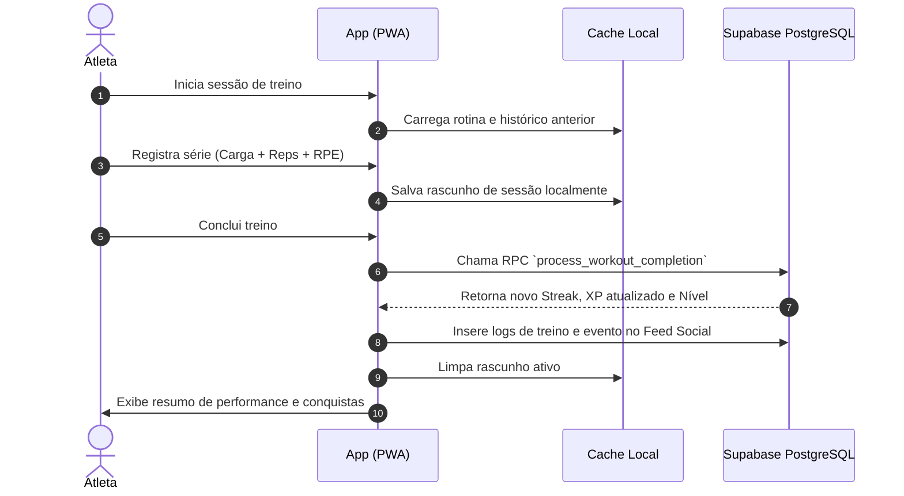

# Corpus Prime

Plataforma mobile-first para prescrição, tracking de treinamento de força, periodização atlética, cálculo de sobrecarga progressiva (e1RM), gamificação de consistência e engajamento comunitário.

---

## Visão Geral

O **Corpus Prime** foi desenvolvido para preencher a lacuna entre planilhas estáticas de treino e aplicativos genéricos de fitness. Focado em atletas e praticantes avançados de musculação, o sistema implementa registro rigoroso de séries, repetições e percepção subjetiva de esforço (RPE), calculando automaticamente a estimativa de 1 Repetição Máxima (e1RM) com base na fórmula de Epley.

A aplicação opera sob uma arquitetura híbrida **Offline-First (PWA)**, permitindo execução contínua em academias com baixa conectividade por meio de Service Workers e cache local em duas camadas, sincronizando com o backend Supabase assim que a conexão é restabelecida.

---

## Principais Funcionalidades

### 1. Gestão e Execução de Treinos
- **Rotinas Estruturadas**: Divisão de treinos por grupamentos musculares, séries alvo, repetições e intervalos de descanso.
- **Rascunho de Treino Ativo**: Persistência do estado do treino em tempo real, evitando perda de progresso em caso de fechamento acidental ou reload.
- **Temporizador de Descanso Integrado**: Cronômetro contextual com notificações visuais e sonoras.
- **Cálculo de e1RM Automático**: Estimativa de carga máxima teórica por série executada via `$e1RM = \text{Peso} \times (1 + \frac{\text{Reps}}{30})$.

### 2. Análise de Performance e Evolução
- **Curva de Carga por Exercício**: Gráficos temporais de evolução de carga máxima e volume acumulado.
- **Métricas Corporais**: Acompanhamento de peso, percentual de gordura e massa magra com cálculo de tendência.
- **Histórico Completo**: Visualização detalhada de sessões anteriores, tonelagem total e exercícios realizados.

### 3. Gamificação e Consistência
- **Atomic Streak Engine**: Função RPC transacional no Postgres com lock (`FOR UPDATE`) para evitar duplicidade e manipulação de sequências diárias.
- **Catálogo de Conquistas**: Sistema de badges categorizados por consistência e performance com ganho de XP e níveis.
- **Níveis e Progressão**: Progressão dinâmica de nível calculada a cada sessão completada.

### 4. Comunidade e Social
- **Feed de Atividades**: Compartilhamento em tempo real de treinos concluídos, novos recordes (PRs) e conquistas desbloqueadas.
- **Feed Interativo**: Sistema de reações e incentivo mútuo entre membros.
- **Perfis Públicos**: Visualização de estatísticas, nível e histórico esportivo.

### 5. Arquitetura PWA & Offline-First
- **Instalação Nativa**: Suporte a PWA standalone com manifesto web, splash screen e ícones adaptativos.
- **Estratégia de Cache**: Service Worker com runtime caching (NetworkFirst) para requisições de API e CacheFirst para assets estáticos.
- **Cache Local de Sessão**: Armazenamento local de rotinas e rascunhos para operação sem internet.

---

## Arquitetura do Sistema



---

## Fluxo de Dados e Ciclo do Treino



---

## Stack Tecnológica

| Camada | Tecnologia | Propósito |
| :--- | :--- | :--- |
| **Core Runtime** | React 18, TypeScript 5.8 | Interface reativa com tipagem estática rigorosa |
| **Build & Bundler** | Vite 5, SWC Plugin | Compilação ultrarrápida e Hot Module Replacement |
| **Estilização** | Tailwind CSS, CSS Variables | Design system responsivo e mobile-first |
| **Componentes UI** | Radix UI Primitives, Lucide Icons | Componentes acessíveis, consistentes e sem emojis |
| **Animações** | Framer Motion | Microinterações de alta fidelidade e transições de página |
| **Data Fetching** | TanStack Query v5 | Cache assíncrono, sincronização e invalidação de queries |
| **Backend & DB** | Supabase (PostgreSQL 15) | Banco relacional, autenticação JWT, RLS e Storage |
| **PWA & Offline** | Vite Plugin PWA, Workbox | Service worker, cache estático e suporte offline |
| **Validação** | Zod, React Hook Form | Validação de formulários e schemas type-safe |
| **Testes** | Vitest, Testing Library | Testes unitários e de integração com ambiente JSDom |

---

## Estrutura do Repositório

```text
corpus-prime/
├── public/                     # Assets estáticos, ícones PWA e manifesto
│   ├── assets/                 # Logotipos e identidades gráficas
│   ├── favicon.ico
│   ├── manifest.json
│   └── robots.txt
├── src/
│   ├── components/             # Componentes modulares e reutilizáveis
│   │   ├── ui/                 # Primitivas de interface baseadas em Radix UI
│   │   ├── BadgeCard.tsx       # Componente de visualização de conquista
│   │   ├── BottomNav.tsx       # Barra de navegação mobile fixa
│   │   ├── ExerciseCard.tsx    # Card de execução de exercício com inputs
│   │   ├── ProtectedRoute.tsx  # Guardião de autenticação de rotas
│   │   └── PWAInstallBanner.tsx# Notificação de instalação de aplicativo
│   ├── contexts/               # Providers de contexto global (AuthContext)
│   ├── data/                   # Estruturas padrão e fallback de dados
│   ├── hooks/                  # Custom hooks (toast, mobile detection, etc.)
│   ├── lib/                    # Utilitários, cliente Supabase, cache e achievements
│   │   ├── achievements.ts     # Engine de validação de regras de conquistas
│   │   ├── cache.ts            # Gerenciador de persistência offline
│   │   ├── supabase.ts         # Inicialização singleton do Supabase Client
│   │   └── utils.ts            # Helpers de formatação e junção de classes
│   ├── pages/                  # Views e rotas principais da aplicação
│   │   ├── Auth.tsx            # Autenticação (Login / Cadastro / Recuperação)
│   │   ├── Badges.tsx          # Galeria de conquistas e progresso de XP
│   │   ├── EmailConfirmed.tsx  # Landing de confirmação de e-mail
│   │   ├── Evolution.tsx       # Dashboard analítico de sobrecarga progressiva
│   │   ├── Index.tsx           # Home / Dashboard central do atleta
│   │   ├── Profile.tsx         # Perfil, métricas corporais e avatar
│   │   ├── Social.tsx          # Feed comunitário e interações
│   │   └── Workout.tsx         # Execução de treino e tracking em tempo real
│   ├── test/                   # Configuração e suíte de testes Vitest
│   ├── App.tsx                 # Roteamento e árvore de providers
│   ├── index.css               # Design tokens, tipografia e diretivas Tailwind
│   └── main.tsx                # Ponto de entrada do bundle React
├── supabase/                   # Schema de banco de dados e migrações
│   ├── migrations/             # Scripts SQL organizados e sequenciais
│   └── README.md               # Documentação técnica do banco e RLS
├── .env.example                # Template seguro de variáveis de ambiente
├── eslint.config.js            # Configuração do ESLint v9
├── package.json                # Manifesto do projeto e dependências
├── tailwind.config.ts          # Configuração do Tailwind CSS
├── tsconfig.json               # Configuração do compilador TypeScript
├── vite.config.ts              # Configuração do bundler Vite e PWA
└── vitest.config.ts            # Configuração do runner de testes Vitest
```

---

## Configuração do Ambiente de Desenvolvimento

### Pré-requisitos
- **Node.js**: Versão 18.0.0 ou superior
- **npm** ou **bun**

### 1. Clonar o Repositório
```bash
git clone https://github.com/seu-usuario/corpus-prime.git
cd corpus-prime
```

### 2. Instalar Dependências
```bash
npm install
```

### 3. Configurar Variáveis de Ambiente
Crie um arquivo `.env` na raiz do projeto com base no modelo `.env.example`:

```bash
cp .env.example .env
```

Edite o arquivo `.env` informando as chaves do seu projeto Supabase:
```env
VITE_SUPABASE_URL=https://seu-projeto.supabase.co
VITE_SUPABASE_ANON_KEY=sua-chave-anonima-aqui
```

### 4. Executar Migrações do Banco de Dados
Acesse o **SQL Editor** no painel do Supabase e execute os scripts contidos em [`supabase/migrations/`](./supabase/migrations/) na ordem numérica indicada.

---

## Scripts Disponíveis

| Comando | Descrição |
| :--- | :--- |
| `npm run dev` | Inicia o servidor de desenvolvimento local com HMR na porta 8080 |
| `npm run build` | Executa o typecheck e gera o bundle otimizado de produção em `dist/` |
| `npm run preview` | Executa um servidor local servindo os arquivos gerados em `dist/` |
| `npm run lint` | Executa a verificação estática de código com ESLint |
| `npm run test` | Executa a suíte de testes unitários com Vitest |
| `npm run test:watch` | Executa os testes em modo watch interativo |

---

## Decisões Técnicas e Trade-offs de Engenharia

### 1. Atomicidade no Registro de Treinos e Sequências
A computação de dias consecutivos de treino (streaks) e distribuição de experiência (XP) foi encapsulada na função PostgreSQL `process_workout_completion` com lock transacional (`SELECT ... FOR UPDATE`). Isso elimina race conditions decorrentes de múltiplos cliques no client e impede fraudes de data enviadas pelo navegador.

### 2. Estratégia de Cache e Resiliência em Conexões Instáveis
Academias frequentemente apresentam zonas sem cobertura 4G/5G ou Wi-Fi. O sistema utiliza persistência em LocalStorage combinada com Service Workers para permitir o preenchimento ininterrupto da sessão. Os dados são sincronizados no momento da conclusão do treino assim que o client recupera conexão de rede.

### 3. Isolamento de Dados com Row Level Security (RLS)
Todas as tabelas críticas (`workouts`, `exercises`, `workout_history`, `workout_logs`, `weekly_schedule`, `user_stats`) possuem políticas de RLS ativadas, garantindo que nenhum usuário possa consultar ou manipular registros que não pertençam ao seu próprio identificador `auth.uid()`.

### 4. Tipagem Estrita e Acessibilidade
A interface foi estruturada com componentes primitivos do Radix UI, garantindo aderência aos padrões WAI-ARIA, suporte total a navegação por teclado e compatibilidade com leitores de tela em dispositivos móveis.

---

## Licença

Este projeto está sob a licença [MIT](./LICENSE).
